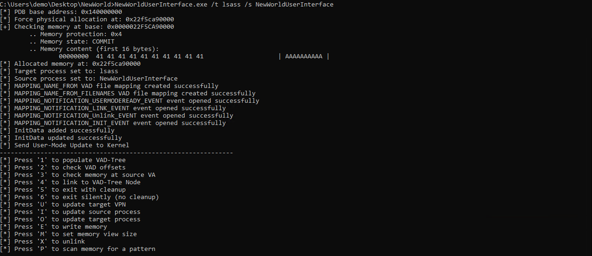
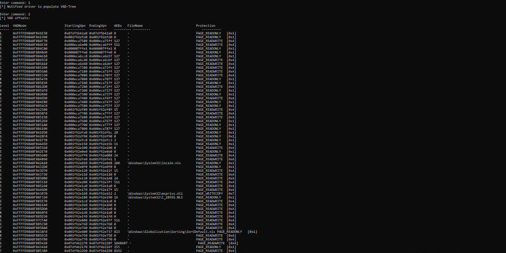
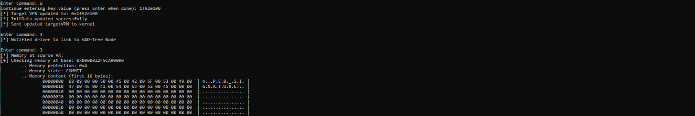
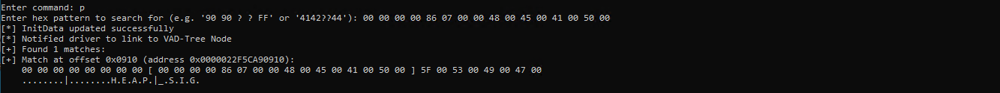
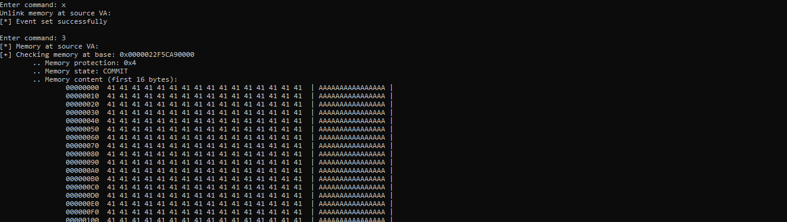

# NewWorldUserInterface

## Overview

This project is a user-mode interface for interacting with a custom Windows kernel driver that exposes process Virtual Address Descriptor (VAD) tree information and allows advanced memory operations between processes. The interface provides a command-line tool to inspect, link, and manipulate memory regions, as well as to scan memory for patterns and update process context information.

**Warning:**  
This project is highly experimental and interacts directly with kernel memory mappings. It may cause system instability or crashes, especially if used incorrectly or if memory pages are swapped out during linking. Use at your own risk.

## Features

- Populate and inspect the VAD tree of a target process.
- Link and unlink memory regions between processes.
- Scan memory for custom byte patterns (with wildcard support).
- Edit memory at specific offsets.
- Update process context and memory view size interactively.
- Symbol resolution for kernel structures using PDB files.

## Installation

### User-Mode Interface

1. Open the `NewWorldUserInterface` solution in Visual Studio 2022.
2. Build the user-mode project as a standard C++14 application.

### Kernel-Mode Driver

- I compiled the kernel part of this project with the following C compiler options: `/Ox /GL /Ot /GT`

- In the driver project settings, ensure that the **Driver Entry** is set to: `DriverEntry`

- Build and deploy the driver according to standard Windows driver development practices. Use `OSR-Tool`

## Usage

1. **Start the kernel driver** (with appropriate privileges). Use `OSR-Tool`
2. **Run the user-mode interface** (`NewWorldUserInterface.exe`). (source must always be your own process ie. `NewWorldUserInterface`)

---

## Command-Line Options

You can launch the user-mode interface (`NewWorldUserInterface.exe`) with the following command-line arguments to pre-set various parameters:

| Option | Description                                 | Example Usage                |
|--------|---------------------------------------------|------------------------------|
| `/s`   | Set the source process name                 | `/s NewWorldUserInterface`   |
| `/t`   | Set the target process name                 | `/t csrss`                   |
| `/i`   | Set the target VPN (virtual page number)    | `/i 0x12345000`              |
| `/m`   | Set the target memory size (bytes)          | `/m 4096` or `/m 0x1000`     |
| `/o`   | Set the target VPN offset                   | `/o 0x2000`                  |

**Example:**               | `NewWorldUserInterface.exe /s NewWorldUserInterface /t lsass`

### Command Reference

After launching, use the following keys to interact:

- `1` — Populate VAD-Tree from the driver.
- `2` — Display VAD offsets and memory regions.
- `3` — Check memory at the source virtual address.
- `4` — Link to a VAD-Tree node (see safety notes below).
- `6` — Exit silently (no cleanup). (Issue `X` before exit)
- `U` — Update the target VPN (virtual page number).
- `I` — Update the source process name.
- `O` — Update the target process name.
- `E` — Edit memory at the source virtual address.
- `M` — Set the memory view size.
- `X` — **Unlink** memory and restore the original mapping (see safety notes below).
- `P` — Scan memory for a byte pattern (supports wildcards).

### Safety Notes

- **Always use the `X` command to unlink and restore the `sourceVA` mapping before exiting or changing mappings.**
- If the target or source page is swapped out while linked, a system crash (bugcheck) is very likely.
- This tool is experimental and may crash or behave unpredictably. Use only in test environments.

## Contributing

This project is experimental and under active development. Crashes and unexpected behavior are possible.  
**If you encounter issues or have improvements, please open an issue or create a pull request!**  
Your feedback and contributions are welcome.

---

**Disclaimer:**  
This software is provided as-is for research and educational purposes. Use it at your own risk. The author is not responsible for any damage or data loss.

